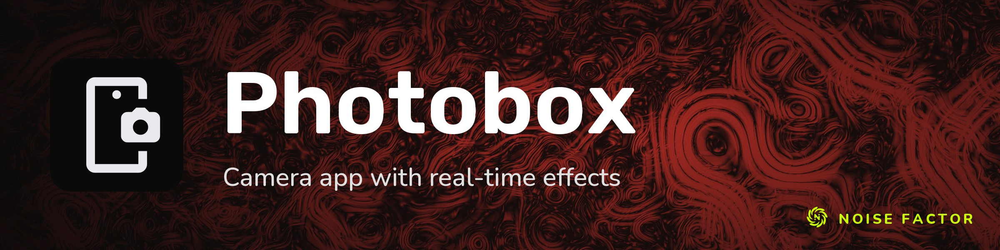

<!-- repo-hero -->
<a href="https://photobox.noisefactor.io/"></a>

<sub>Open source from <a href="https://noisefactor.io">Noise Factor</a> &middot; <a href="https://github.com/noisefactorllc">more projects</a></sub>

# Photobox

Photo Booth clone powered by the [Noisemaker](https://noisemaker.app/) shader pipeline. Real-time WebGL effects on your webcam feed.

## Features

- 3x3 live preview grid with shader effects
- Tabbed effect categories (Effects, Distortions)
- Photo capture and video recording
- Filmstrip gallery with IndexedDB persistence
- Mobile responsive with front/rear camera switching
- No build step — pure vanilla JS with ES modules

## Getting Started

Requires [Node.js](https://nodejs.org/) 18+.

```bash
npm install
npm run dev
```

Open http://localhost:3005 in your browser. Grant camera access when prompted.

## Testing

```bash
npx playwright install  # first time only
npm test
```

## Tech Stack

- Vanilla JavaScript (ES modules, no framework)
- [Noisemaker](https://noisemaker.app/) shader pipeline via CDN
- [Playwright](https://playwright.dev/) for end-to-end testing
- Served with `http-server` — no build tools needed

## License

[MIT](LICENSE) — Copyright (c) 2026 Noise Factor LLC
